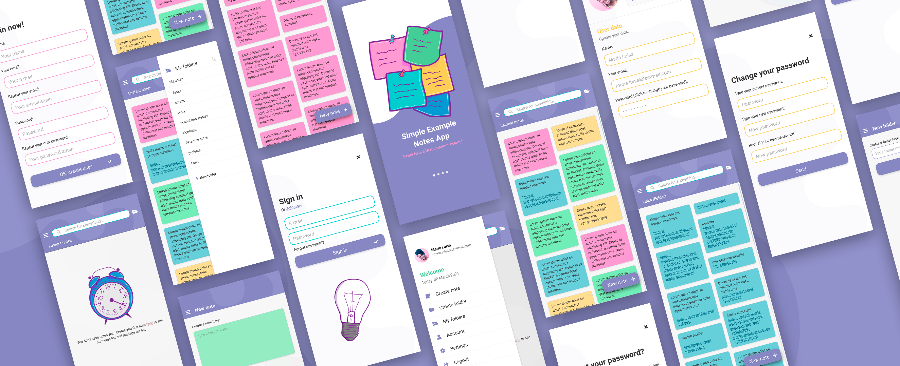

# Notes App Sample
## Sample UI Animated Screens in React Native

by [@marialuisacp](https://github.com/marialuisacp)

This project was been done to pratice animations in UI components in React Native. For this purpose, I have designed a UI screens and components to a notes app sample and the implementation code is here.

Technogies used
* React Native
* React Navigation
* React Hooks

Resources used in UI elements:
* Components: custom React Native components
* Icons: react-native-fontawesome
* Images: drew by me

---
## Animations

* Buttons:

