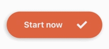

# Notes App Sample
## Sample UI Animated Screens in React Native

by [@marialuisacp](https://github.com/marialuisacp)

<!--  -->

This project was been done to pratice animations in UI components in React Native. For this purpose, I have designed a UI screens and components to a notes app sample and the implementation code is here.

Technogies used:
* React Native
* React Navigation
* React Hooks

Resources used in UI elements:
* Components: custom React Native components
* Icons: react-native-fontawesome
* Images: drew by me

---
## Animations

* Screens and transitions:


* Buttons effect:


* Buttons click:




* Note Component:


* Texts:


* Inputs:


---
## Running

### Install dependencies

First, install dependencies:

```
yarn install
```

### To run

Open a terminal and execute:

```
yarn start
```

In other terminal, execute:

```
react-native run-ios
```

or

```
react-native run-android
```